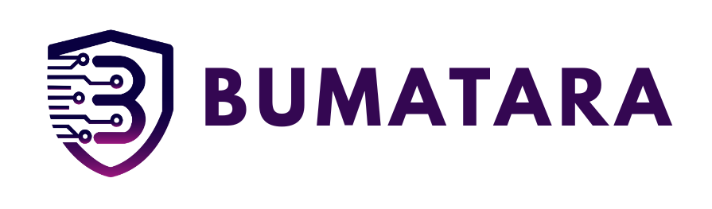

# 

# Bumatara: Phishing URL Checker

Bumatara is a web application designed to help users check for phishing websites, improve digital literacy, and assist regulators in reporting and tracking phishing incidents. Built with Laravel and PHP, Bumatara provides a user-friendly interface and robust features for both the public and regulatory bodies.

## Features

- **Phishing Website Checker:** Instantly check if a website is potentially a phishing site.
- **Digital Literacy Resources:** Educational materials to help users recognize and avoid online scams.
- **Phishing Report Export:** Generate and export reports for regulatory or personal use.
- **User Authentication:** Secure login and registration system.
- **Dashboard:** Overview of recent phishing checks and reports.
- **History & Logs:** Track previous checks and user activity.
- **Responsive Design:** Built with Bootstrap 5 for mobile and desktop compatibility.

## Technologies Used

- **Laravel** (PHP Framework)
- **PHP**
- **Bootstrap 5**
- **Vite** (for asset bundling and hot reloading)
- **JavaScript**
- **Blade Templating Engine**

## Getting Started

### Prerequisites

- PHP >= 8.1
- Composer
- Node.js & npm
- MySQL or compatible database

### Installation

1. **Clone the repository:**
   ```bash
   git clone https://github.com/yourusername/bumatara.git
   cd bumatara
   ```

2. **Install PHP dependencies:**
   ```bash
   composer install
   ```

3. **Install JavaScript dependencies:**
   ```bash
   npm install
   ```

4. **Copy and configure environment variables:**
   ```bash
   cp .env.example .env
   ```
   Edit `.env` to match your database and mail settings.

5. **Generate application key:**
   ```bash
   php artisan key:generate
   ```

6. **Run migrations:**
   ```bash
   php artisan migrate
   ```

7. **Build frontend assets:**
   ```bash
   npm run build
   ```
   For development, you can use:
   ```bash
   npm run dev
   ```

8. **Start the development server:**
   ```bash
   php artisan serve
   ```
   Visit [http://localhost:8000](http://localhost:8000) in your browser.

## Usage

- Register or log in to access the phishing checker and dashboard.
- Enter a website URL to check for phishing.
- View and export reports as needed.
- Access educational resources to improve your digital literacy.

## Contributing

Contributions are welcome! Please open an issue or submit a pull request for improvements or bug fixes.

## License

This project is licensed under the MIT License.

## Author

- ...
- ...
- ...
